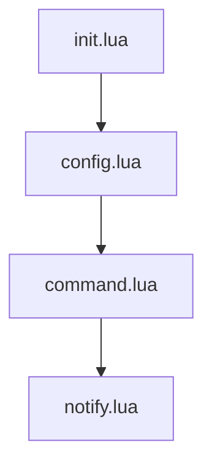

# Graph

# init.lua

`config.lua`を呼び出す。
`setup`関数を定義している。

# config.lua

ユーザーが設定した option を適用する。
`command.lua`を呼び出す。

# command.lua

`SayHello`コマンドを nvim に登録する。
`notify.lua`を呼び出す。

# notify.lua

コマンドの実装。
vim.notify API を呼び出す。
